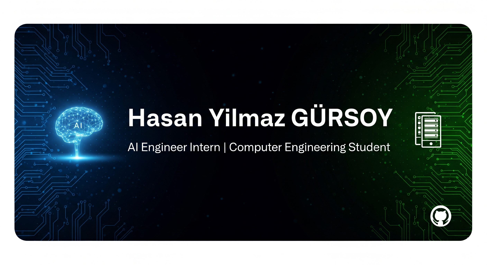

<!-- Bu dosya, GitHub profil README'niz için iskelet şablondur. Yer tutucuları dolduracağız. -->

  <!-- Başlık görseli (isteğe bağlı) -->
  <!-- Aşağıdaki URL'yi kendi banner/GIF görselinizle değiştirin -->
  <!-- Banner: Hazır olduğunda bu görseli kendi banner linkinizle değiştirin -->
  

  <h1>Merhaba, ben Hasan Yılmaz Gürsoy 👋</h1>
  
<strong>AI Engineer Intern | Computer Engineering Student</strong>

  
<em>Bilgisayar mühendisliği 4. sınıf öğrencisi, yapay zeka ve veri bilimi alanında kendini geliştiren bir yazılım meraklısı.</em>

  

    
    &nbsp;
    
  

  
<strong>Open to AI Intern roles | Malatya / Remote</strong>

  <!-- Hızlı rozetler (shields.io) -->
  <!-- Örnek:  -->

---

### 🙋‍♂️ Hakkımda
Karmaşık problemleri veriden anlam çıkaran yapay zeka çözümleriyle sadeleştirmeyi seviyorum. Özellikle
bilgisayarlı görü ve metin işleme alanlarında ürünleşebilir çözümler geliştirmeye odaklanıyorum. Ekip
çalışmasına ve temiz koda önem veriyor, deneyimlerimi gerçek dünyadaki problemlere uygulayarak
değer üretmeyi hedefliyorum.

### 🔭 Şu an üzerinde çalışıyorum
- Fatura Tanıma ve İşleme Uygulaması
- TaşıTaşı

### 🌱 Öğreniyorum / Derinleşiyorum
- Derin öğrenme modelleri (NLP & Görüntü işleme)
- Büyük veri analizi ve dağıtık sistemler

### 💬 İlgi alanlarım
- Yapay Zeka • Görüntü İşleme • Veri Bilimi • Django

### 💻 Kullandığım Teknolojiler

  <!-- İkon örnekleri: Devicon -->
  
  
  
  
  
  
  
  
  
  
  

### 📈 GitHub İstatistikleri

### 📌 Öne Çıkan Projelerim

### 📫 Bana Ulaşın

  
  
  

---

